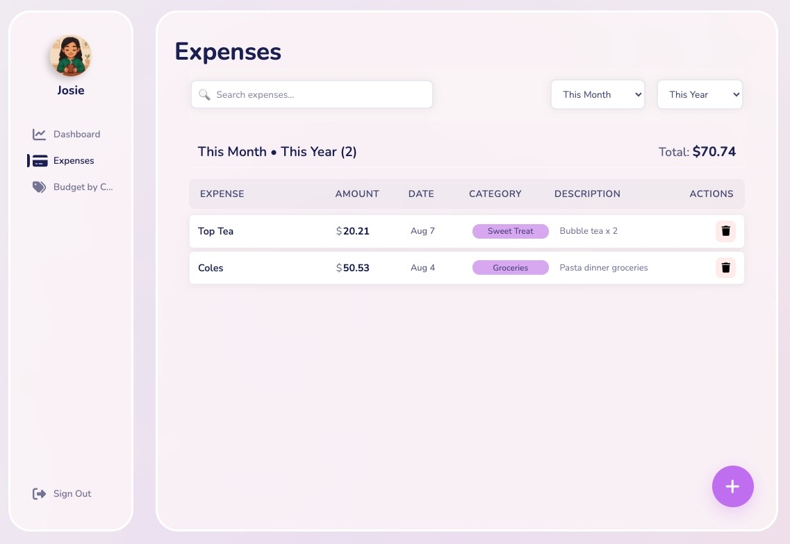
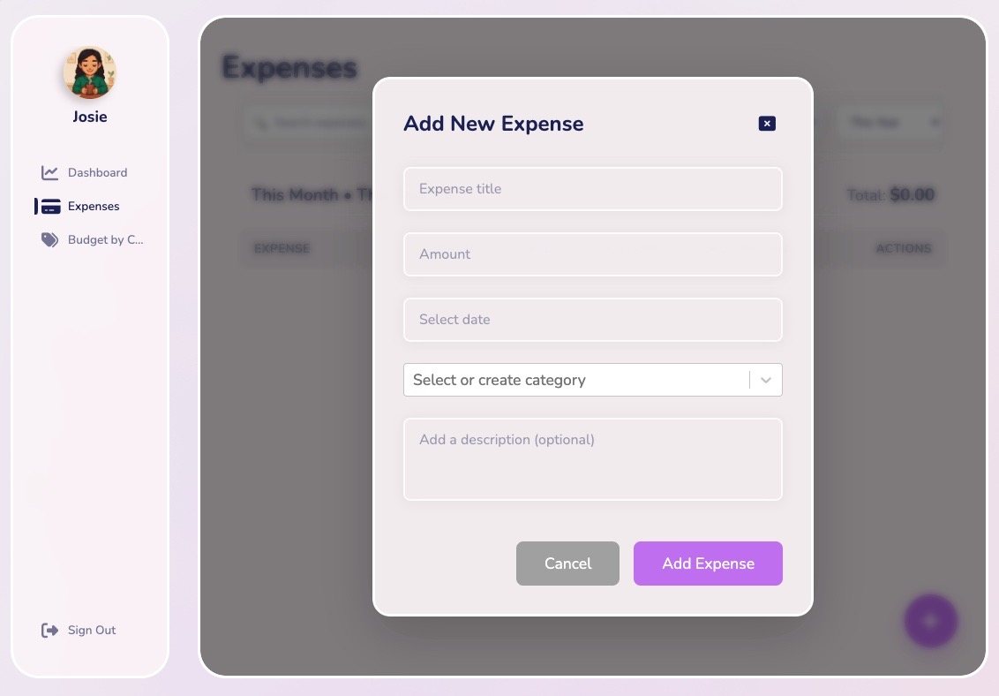
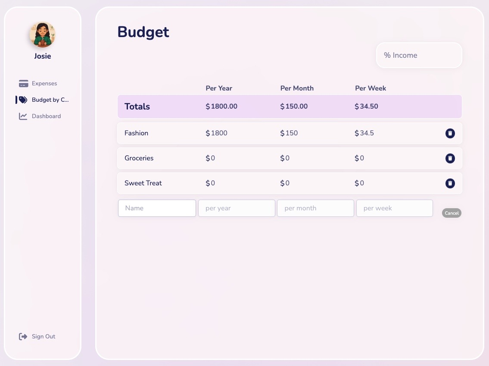

# Expense Tracker App

A full-stack expense tracking application that helps users manage their finances by tracking expenses, setting budgets, and organizing spending by categories.
Built using the MERN stack.

## 🚀 Features

- **User Authentication**: Secure registration and login with JWT tokens
- **Expense Management**: Add, view, and delete expenses
- **Category System**: Create custom categories with flexible budgeting
- **Budget Tracking**: Set budgets per year, month, or week for each category
- **Expense Filtering**: Filter and search through your expenses
- **Data Visualization**: Charts and graphs to visualize spending patterns (In progress)
- **Responsive Design**: Works seamlessly on desktop and mobile devices

## 🛠️ Tech Stack

**Frontend:**
- React 18
- Styled Components
- Axios for API calls

**Backend:**
- Node.js
- Express.js
- MongoDB with Mongoose
- JWT for authentication
- CORS enabled

**Testing:**
- Jest (Backend)
- Supertest for API testing
- MongoDB Memory Server for test database

## 📁 Project Structure

```
expense-tracker/
├── frontend/          # React application
├── backend/           # Express.js API server
├── README.md         
└── .gitignore
```

## 🚀 Quick Start

### Prerequisites

- Node.js (v14 or higher)
- MongoDB (local installation or MongoDB Atlas)
- npm or yarn

### Installation

1. **Clone the repository**
   ```bash
   git clone https://github.com/jileye1/expense-tracker.git
   cd expense-tracker
   ```

2. **Install backend dependencies**
   ```bash
   cd backend
   npm install
   ```

3. **Install frontend dependencies**
   ```bash
   cd ../frontend
   npm install
   ```

4. **Environment Setup**
   
   Create `.env` files in both frontend and backend directories:
   
   **Backend `.env`:**
   ```env
   NODE_ENV=development
   PORT=3001
   MONGO_CONNECTION_STRING=your_mongodb_connection_string
   JWT_SECRET=your_jwt_secret
   JWT_TEST_SECRET=your_test_jwt_secret
   ```
   
   **Frontend `.env`:**
   ```env
   REACT_APP_SERVER_URL=http://localhost:3001/api/v1
   ```

5. **Start the application**
   
   **Backend (Terminal 1):**
   ```bash
   cd backend
   npm start
   ```
   
   **Frontend (Terminal 2):**
   ```bash
   cd frontend
   npm start
   ```

6. **Access the application**
   - Frontend: http://localhost:3000
   - Backend API: http://localhost:3001/api/v1

## 🧪 Testing

**Backend Tests:**
```bash
cd backend
npm test                # Run tests once
npm run test:watch      # Run tests in watch mode
npm run test:coverage   # Run tests with coverage report
```

## 📖 API Documentation

The API is organized into three main endpoints:

- **Authentication**: `/api/v1/auth` - User registration, login, and profile
- **Expenses**: `/api/v1/expenses` - CRUD operations for expenses
- **Categories**: `/api/v1/categories` - CRUD operations for categories with budget management

For detailed API documentation, see the [Backend README](./backend/README.md).

## 🔐 Authentication

All API endpoints (except registration and login) require authentication via JWT tokens. Include the token in the Authorization header:

```
Authorization: Bearer <your-jwt-token>
```

## 📸 Screenshots

### Main Expense Management

*View and manage your expenses with filtering and categorization*

### Add New Expense

*Intuitive expense entry with category selection*

### Budget Management

*Set and track budgets by category with flexible time periods*

## 🚧 Work in Progress

This project is actively being developed as part of a portfolio for software engineering opportunities. While functional, several features and improvements are currently in progress:

### Backend Features
- **Update API Endpoint**: Currently only CREATE, READ, DELETE operations are implemented. UPDATE endpoint is planned.

### Frontend Development
- **Dashboard Page**: Comprehensive spending analytics and overview dashboard
- **UI Improvements**: Ongoing restyling and polish for better user experience
- **Folder Reorganization**: Restructuring components vs pages for better project architecture
- **Component Refactoring**: Migrating to reusable form, modal, and button components throughout the app
- **Mobile Responsiveness**: Improving layout and usability on smaller screens
- **Custom Error Handling**: Replacing basic alert popups with polished, user-friendly error messages

## 🚀 Upcoming Features

- Dashboard with spending overview and analytics
- Budget vs. actual spending comparisons
- Export functionality (CSV)
- Income tracking

## 🤝 Contributing

1. Fork the repository
2. Create a feature branch (`git checkout -b feature/amazing-feature`)
3. Commit your changes (`git commit -m 'Add some amazing feature'`)
4. Push to the branch (`git push origin feature/amazing-feature`)
5. Open a Pull Request

## 📄 License

This project is licensed under the MIT License.

## 🐛 Issues

If you encounter any issues or have feature requests, please create an issue on the GitHub repository.

## 📞 Support

For support or questions, please open an issue or contact me at josieleye.dev@gmail.com.